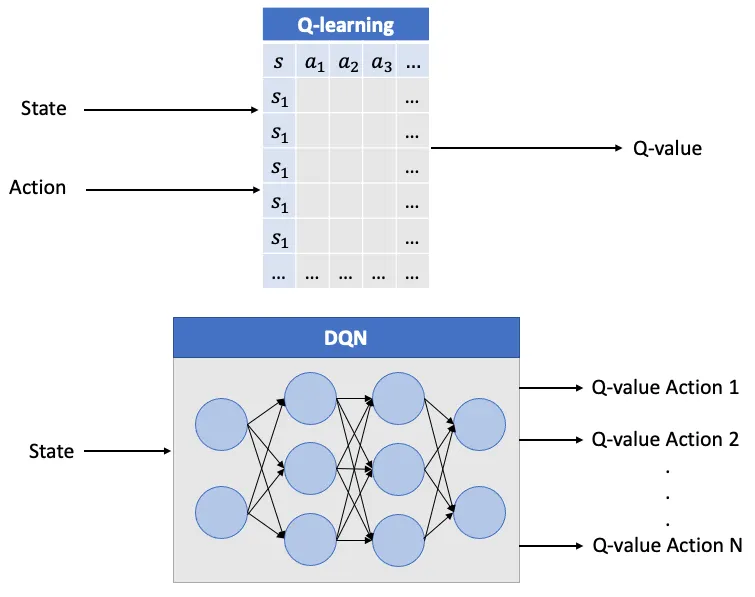
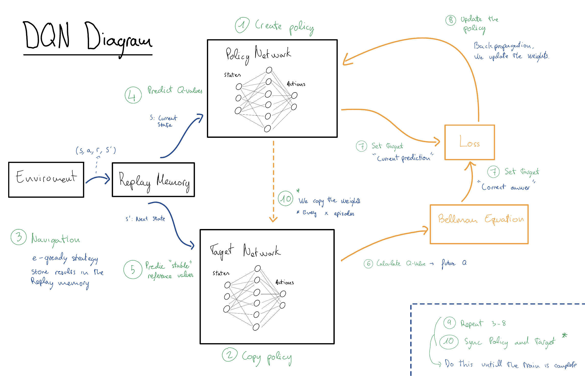

# 📘 Technical Report: Deep Q-Networks (DQN)

## 3. DQN: Deep Q-Networks (The Value-Based Foundation)

DQN represents the first major successful integration of Deep Learning with Reinforcement Learning. It was the breakthrough that allowed agents to move beyond simple grids and solve tasks with high-dimensional sensory inputs, such as raw pixels, by approximating the optimal action-value function $Q^*(s, a)$ using a neural network.

---

### 3.1 Theoretical Framework
DQN is fundamentally a **Value-Based** method. It does not learn a policy directly; instead, it learns to estimate the "quality" of taking a specific action in a specific state.

#### The Bellman Equation
The agent improves its estimation by iteratively solving the Bellman Equation. The goal is to minimize the difference between the current Q-prediction and the "Target" (the immediate reward plus the discounted value of the next best state):

$$Q(s, a) \leftarrow Q(s, a) + \alpha [r + \gamma \max_{a'} Q(s', a') - Q(s, a)]$$

#### The Loss Function
To train the neural network (CNN), we minimize the **Mean Squared Error (MSE)** between our current prediction and the stable target:

$$L(\theta) = \mathbb{E} \left[ ( \underbrace{r + \gamma \max_{a'} Q(s', a'; \theta^{-})}_{\text{Stable Target}} - \underbrace{Q(s, a; \theta)}_{\text{Current Prediction}} )^2 \right]$$

* **$\gamma$ (Gamma):** The discount factor (usually 0.99).
* **$\theta$:** Weights of the Policy Network.
* **$\theta^{-}$:** Weights of the Target Network.

---

### 3.2 Evolution: From Q-Table to Neural Network
The core shift in DQN is the **representation of knowledge**.

* **Q-Learning (The Table):** Traditional RL uses a literal matrix (Q-Table). In a 96x96 pixel environment like `CarRacing-v2`, there are too many possible pixel combinations to store in a table.
* **DQN (The Approximator):** Uses a **Convolutional Neural Network (CNN)** as a function approximator. The network takes the pixel stack as input and predicts the Q-values for all available actions simultaneously. This allows the agent to **generalize**—it learns that a "red curb" means a turn, even if it has never seen that exact pixel arrangement before.

*Figure 1: Structural comparison between traditional Tabular Q-Learning and Deep Q-Networks (DQN). Traditional Q-Learning relies on an exhaustive lookup table, which becomes computationally infeasible for high-dimensional sensory inputs. In contrast, DQN utilizes a neural network (CNN) to approximate Q-values, enabling the agent to generalize patterns and features from raw pixel observations.*
**Source:** [Marta Comes Hernandez (Medium)](https://medium.com/@mcomeshernandez/reinforcement-learning-diving-into-deep-q-networks-dqn-92f237f448ec)

### 3.3 The Three Pillars of Stability
Standard neural networks are notoriously unstable when used for RL because the data is non-stationary (the agent's behavior changes as it learns). DQN solves this with three key mechanisms:

#### A. Epsilon-Greedy Strategy (Exploration vs. Exploitation)
Since DQN is a deterministic value-based method, the agent would always take the same "greedy" action if not forced to explore.
* **Mechanism:** With probability $\epsilon$, the agent chooses a random action (discovery); with probability $1-\epsilon$, it chooses the action with the highest predicted Q-value (mastery).
* **Decay:** We start with $\epsilon = 1.0$ and slowly decrease it as the agent becomes more proficient.

#### B. Experience Replay (The Replay Buffer)
In a driving simulation, consecutive frames are nearly identical. If the network learns from these frames in order, it suffers from "catastrophic forgetting" and high data correlation.
* **Mechanism:** The agent stores its experiences $(s, a, r, s')$ in a large memory buffer. 
* **Random Sampling:** During training, we pull a random "mini-batch" of memories. This breaks the temporal link between frames and ensures the gradient updates are stable and diverse.

#### C. Target Networks (The Anchor)
If we use the same network to calculate the prediction and the target, the target moves every time we update the weights. This creates a feedback loop that often leads to divergence.
* **Mechanism:** DQN uses two networks:
    1.  **Policy Network ($\theta$):** Updated every step; used to select actions.
    2.  **Target Network ($\theta^{-}$):** A frozen copy used to calculate the stable target. It is synchronized with the Policy Network only every $N$ steps.

### 3.4 Classification (Taxonomy)
Following the **ABCD** pillars of RL, DQN is classified as:
* **A. Action Space:** **Discrete**. DQN cannot naturally output a range of numbers. We must discretize the CarRacing controls (e.g., Action 0: Hard Left, Action 1: Straight, Action 2: Hard Right).
* **B. Policy Type:** **Deterministic**. It seeks the single highest value for a given state.
* **C. Paradigm:** **Off-Policy**. It reuses data from the Replay Buffer regardless of the current policy.
* **D. Architecture:** **Value-Based**. It focuses on the $Q$ function rather than a separate Actor.

### 3.5 Step-by-Step Training Loop

### DQN Training Process Schematic

1.  **Initialization:** Create the **Policy Network** with random weights.
2.  **Initial Sync:** Copy weights from the Policy Network to the **Target Network** to start with identical states.
3.  **Navigation:** The agent interacts with the **Environment** using an $\epsilon$-greedy strategy and stores experiences in the **Replay Memory**.
4.  **Prediction (Policy):** The Policy Network predicts the current **Q-values** for the sampled state.
5.  **Reference (Target):** The Target Network generates **stable reference values** for the next state.
6.  **Bellman Equation:** Inputs from the previous steps are processed through the Bellman formula.
7.  **Set Target:** Establish the **"Correct Answer"** (Target Vector) based on the Bellman calculation.
8.  **Optimization (Update):** The **Loss** box calculates the discrepancy between the target and the current prediction, driving the **Policy Network update** via backpropagation.
9.  **Repetition:** The loop (steps 3–8) repeats iteratively to refine the agent's strategy.
10. **Synchronization:** Periodically sync weights from the Policy Network to the Target Network to maintain training stability.

*Figure 1: Procedural architecture and data flow of a Deep Q-Network (DQN) training cycle.*

---

