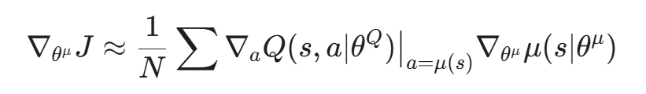
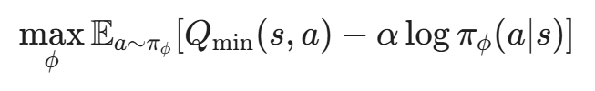
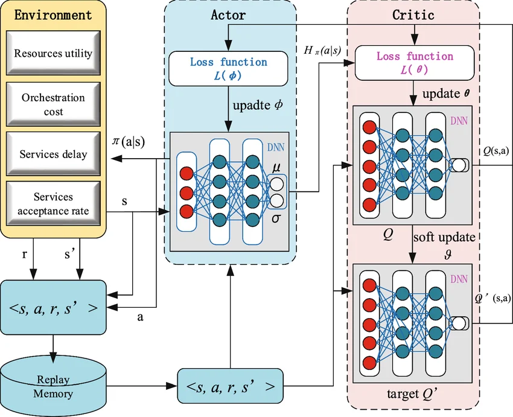

  

# BRNO UNIVERSITY OF TECHNOLOGY
### FACULTY OF INFORMATION TECHNOLOGY

   

<h1 style="text-align: center; margin-bottom: 5px;">
     DQN, DDPG, TD3, SAC
  </h1>
  
  <h3 style="text-align: center; font-weight: normal; color: #444; margin-top: 0;">
    Basics of this methods, problems and comparation
  </h3>

 

 

**Author:** Eduardo Martin Posigo
 
*Erasmus Student*

 

**VUT Login:** xmartie01
 
**VUT ID:** 276938

    

**Date:** March 29, 2026

---
# Table of Contents

1. Introduction
2. Core definitions and overview
   + 2.1. A. Action Spaces
   + 2.2. B. Policy Types (The Decision Logic)
   + 2.3. C. Paradigms (The Data Efficiency)
   + 2.4. D. Architectures (The Brain Structure)
   + 2.5. Comparative Methodology Overview
3. DQN: Deep Q-Networks (The Value-Based Foundation)
   + 3.1. Evolution: From Q-Table to Neural Network
   + 3.2. Theoretical Framework
   + 3.3. Stability
   + 3.4. Step-by-Step Training Loop
4. DDPG: Deep Deterministic Policy Gradient
   + 4.1. Architecture and Components
   + 4.2. The Learning Mechanism
   + 4.3. The Problem: Overestimation Bias
   + 4.4. Training loop
5. TD3: Twin Delayed DDPG
   + 5.1. Improvements
   + 5.2. Training Loop
   + 5.3. Summary Comparison DDPG vs TD3
6. Soft Actor-Critic (SAC)
   + 6.1. Maximum Entropy Reinforcement Learning
   + 6.2. The Temperature Parameter (α)
   + 6.3. Architecture: Twin Critics and the Reparameterization Trick
   + 6.4. SAC Training Flow
7. Conclusion
8. References
---

## 1. Introduction
Modern Deep Reinforcement Learning (DRL) has evolved from simple tabular methods to complex architectures capable of handling high-dimensional state spaces and continuous action domains. This report examines the transition from value-based discrete methods to state-of-the-art actor-critic stochastic frameworks, focusing on the mechanical improvements that provide stability and efficiency.

---

## 2. Core definitions and overview
To classify any Reinforcement Learning algorithm, we evaluate it across these four fundamental dimensions.

### 2.1 Action Spaces 
* **Discrete:** The agent chooses from a finite, fixed set of actions.
    * *LaTeX:* $a \in \{0, 1, ..., n-1\}$.
    * *Analogy:* Using a D-pad or a keyboard (binary choices).
* **Continuous:** The agent outputs real-valued vectors, allowing for infinite precision within bounds.
    * *LaTeX:* $a \in \mathbb{R}^d$ typically within $[-1, 1]$.
    * *Analogy:* Using a steering wheel or a throttle pedal (gradient choices).

### 2.2 Policy Types (The Decision Logic)
* **Deterministic:** Maps a state directly to a single, specific action.
    * *Formula:* $a = \mu(s)$.
    * *Behavior:* Exploitative and precise; requires external noise (like Gaussian) to explore.
* **Stochastic:** Maps a state to a probability distribution (usually a Gaussian mean $\mu$ and variance $\sigma$).
    * *Formula:* $a \sim \pi(a|s)$.
    * *Behavior:* Naturally exploratory; better for complex environments and handling uncertainty.

### 2.3 Paradigms (The Data Efficiency)
* **On-Policy:** The agent learns only from data collected by its *current* version. Data is discarded after the update.
    * *Example:* **PPO**.
    * *Trait:* Stable but "expensive" (requires constant new environment interactions).
* **Off-Policy:** The agent learns from a **Replay Buffer** containing experiences from past versions of itself.
    * *Example:* **DQN, SAC, TD3**.
    * *Trait:* Highly sample-efficient; reuses data many times to squeeze out more learning.

### 2.4 Architectures (The Brain Structure)
* **Value-Based:** Focuses exclusively on estimating the "quality" ($Q$) of every possible action. The policy is implicitly to "pick the highest $Q$."
    * *Constraint:* Hard to use in continuous spaces because you cannot calculate $\max$ over infinite values.
    * *Example:* **DQN**.
* **Actor-Critic:** Splits the model into two specialized networks.
    * **The Actor:** Learns *how* to behave (the policy).
    * **The Critic:** Learns to estimate the value of the Actor's actions.
    * *Example:* **DDPG, TD3, SAC, PPO**.
---
### 2.5 Comparative Methodology Overview
Once these few aspects are clarified, we can better understand the differences between each approach.

|  | **DQN** | **DDPG** | **TD3** | **SAC** | **PPO** |
| :--- | :--- | :--- | :--- | :--- | :--- |
| **Paradigm** | Off-Policy | Off-Policy | Off-Policy | Off-Policy | On-Policy |
| **Action Space** | Discrete | Continuous | Continuous | Continuous | Continuous |
| **Policy Type** | Deterministic | Deterministic | Deterministic | Stochastic | Stochastic |
| **Architecture** | Value-Based | Actor-Critic | Actor-Critic | Actor-Critic | Actor-Critic |
| **Exploration** | $\epsilon$-greedy | Added Noise | Added Noise | Max Entropy | Probability Dist. |
| **Stability** | Medium | Low | High | Very High | High |
| **Sample Efficiency**| High | High | High | Very High | Low |

---

## 3. DQN: Deep Q-Networks (The Value-Based Foundation)

DQN represents the first major successful integration of Deep Learning with Reinforcement Learning. It was the breakthrough that allowed agents to move beyond simple grids and solve tasks with high-dimensional sensory inputs, such as raw pixels, by approximating the optimal action-value function $Q^*(s, a)$ using a neural network.

### 3.1 Evolution: From Q-Table to Neural Network
The core shift in DQN is the **representation of knowledge**.

* **Q-Learning (The Table):** Traditional RL uses a literal matrix (Q-Table). 
* **DQN (The Approximator):** Uses a **Convolutional Neural Network (CNN)** as a function approximator. The network takes the pixel stack as input and predicts the Q-values for all available actions simultaneously. This allows the agent to **generalize**—it learns that a "red curb" means a turn, even if it has never seen that exact pixel arrangement before.

*Figure 1: Structural comparison between traditional Tabular Q-Learning and Deep Q-Networks (DQN). Traditional Q-Learning relies on an exhaustive lookup table, which becomes computationally infeasible for high-dimensional sensory inputs. In contrast, DQN utilizes a neural network (CNN) to approximate Q-values, enabling the agent to generalize patterns and features from raw pixel observations.*

### 3.2 Theoretical Framework
DQN is fundamentally a **Value-Based** method. It does not learn a policy directly; instead, it learns to estimate the "quality" of taking a specific action in a specific state. It relies on a discrete set of actions to calculate a maximum $Q$-value.

#### The Bellman Equation
The agent improves its estimation by iteratively solving the Bellman Equation. The goal is to minimize the difference between the current Q-prediction and the "Target" (the immediate reward plus the discounted value of the next best state):

$$Q(s, a) \leftarrow Q(s, a) + \alpha [r + \gamma \max_{a'} Q(s', a') - Q(s, a)]$$

Where:
* **$Q(s, a)$**: The current Q-value (action-value) for being in state $s$ and taking action $a$.
* **$\leftarrow$**: The update operator, meaning the value on the left is replaced by the result on the right.
* **$\alpha$ (Alpha)**: The learning rate (determines how much new information overrides old information).
* **$r$**: The immediate reward received after taking action $a$ in state $s$.
* **$\gamma$ (Gamma)**: The discount factor (usually between 0 and 1) that weighs future rewards.
* **$\max_{a'} Q(s', a')$**: The maximum estimated future reward for the next state $s'$, choosing the best possible action $a'$.
* **$r + \gamma \max_{a'} Q(s', a')$**: Known as the **TD Target** (Temporal Difference Target).
* **$[ \dots - Q(s, a) ]$**: Known as the **TD Error**, representing the difference between the estimated target and the current value.

#### The Loss Function
To train the neural network (CNN), we minimize the **Mean Squared Error (MSE)** between our current prediction and the stable target:

$$L(\theta) = \mathbb{E} \left[ ( {r + \gamma \max_{a'} Q(s', a'; \theta^{-})} - {Q(s, a; \theta)} )^2 \right]$$

Where
* **$\gamma$ (Gamma):** The discount factor (usually 0.99).
* **$\theta$:** Weights of the Policy Network.
* **$\theta^{-}$:** Weights of the Target Network.

### 3.3 Stability
Standard neural networks are notoriously unstable when used for RL because the data is non-stationary (the agent's behavior changes as it learns). DQN solves this with three key mechanisms:

#### A. Epsilon-Greedy Strategy (Exploration vs. Exploitation)
Since DQN is a deterministic value-based method, the agent would always take the same "greedy" action if not forced to explore.
* **Mechanism:** With probability $\epsilon$, the agent chooses a random action (discovery); with probability $1-\epsilon$, it chooses the action with the highest predicted Q-value (mastery).
* **Decay:** We start with $\epsilon = 1.0$ and slowly decrease it as the agent becomes more proficient.

#### B. Experience Replay (The Replay Buffer)
In a driving simulation, consecutive frames are nearly identical. If the network learns from these frames in order, it suffers from "catastrophic forgetting" and high data correlation.
* **Mechanism:** The agent stores its experiences $(s, a, r, s')$ in a large memory buffer. 
* **Random Sampling:** During training, we pull a random "mini-batch" of memories. This breaks the temporal link between frames and ensures the gradient updates are stable and diverse.

#### C. Target Networks (The Anchor)
If we use the same network to calculate the prediction and the target, the target moves every time we update the weights. This creates a feedback loop that often leads to divergence.
* **Mechanism:** DQN uses two networks:
    1.  **Policy Network ($\theta$):** Updated every step; used to select actions.
    2.  **Target Network ($\theta^{-}$):** A frozen copy used to calculate the stable target. It is synchronized with the Policy Network only every $N$ steps.

### 3.4 Step-by-Step Training Loop

#### 1. Initialization
1. **Current Q-Network**: Initialize a network $Q(s, a|\theta)$ with random weights to estimate the action-value function.
2. **Target Q-Network**: Initialize a twin network $Q'$ with the same weights: $\theta' \leftarrow \theta$.
3. **Memory**: Initialize a **Replay Buffer** $D$ with a fixed capacity.
4. **Parameters**: Set the exploration rate $\epsilon$ (epsilon), discount factor $\gamma$, and the target update frequency $C$.

#### 2. Interaction Phase (Acting)
For each time step:
1. **Epsilon-Greedy Selection**: 
   - With probability $\epsilon$, select a **random action** $a$ (exploration).
   - Otherwise, select $a = \arg\max_a Q(s, a|\theta)$ (exploitation).
2. **Execute**: Perform action $a$, observe reward $r$ and next state $s'$.
3. **Store**: Save the transition $(s, a, r, s', \text{done})$ in the **Replay Buffer** $D$.
4. **Decay**: Gradually reduce $\epsilon$ over time to shift from exploration to exploitation.

#### 3. Learning Phase (Training)
Sample a random minibatch of $N$ transitions from $D$:

- A. Compute Target Q-Value:

Unlike DDPG, DQN uses the **maximum** predicted Q-value of the next state to calculate the target:
$$y = \begin{cases} r & \text{if episode ends at } s' \\ r + \gamma \max_{a'} Q'(s', a'|\theta') & \text{otherwise} \end{cases}$$
+ Where:
  * **$y$**: The target value for the update.
  * **$r$**: The reward received.
  * **$s'$**: The next state reached.
  * **$\gamma$ (Gamma)**: The discount factor.
  * **$\max_{a'} Q'(s', a'|\theta')$**: The maximum estimated future reward for the next state, calculated by the target network with weights $\theta'$.
  * **$Q'$**: The target network (a copy of the main Q-network used for stability).
*Note: We use the **Target Network** ($Q'$) here to provide a stable ground truth.*

 

+ B. Update Current Q-Network
The network is trained to minimize the Mean Squared Error (MSE) between its current estimate and the calculated target $y$:
$$L = \frac{1}{N} \sum (y - Q(s, a|\theta))^2$$
+ Where:
  * **$L$**: The Loss function (Mean Squared Error) to be minimized during training.
  * **$N$**: The batch size (number of transitions sampled from the replay buffer).
  * **$\sum$**: Summation over all samples in the batch.
  * **$y$**: The target value (the "ground truth" estimate calculated using the Bellman equation).
  * **$Q(s, a|\theta)$**: The current Q-value predicted by the network for state $s$ and action $a$.
  * **$\theta$**: The parameters (weights) of the Q-network that are being optimized.
  * **$(y - Q(...))^2$**: The squared difference (error) between the target and the prediction.
*Update $\theta$ using an optimizer (like Adam).*

#### 4. Target Network Synchronization
DQN typically uses a **Hard Update** strategy, though soft updates are also possible:
- **Hard Update**: Every $C$ steps, copy the weights from the Current Network to the Target Network: $\theta' \leftarrow \theta$.
- **Soft Update (Alternative)**: $\theta' \leftarrow \tau \theta + (1 - \tau) \theta'$.

*Figure 2: Procedural architecture and data flow of a Deep Q-Network (DQN) training cycle.*

---

## 4. DDPG:

DDPG was developed as a solution to the limitations of Deep Q-Networks (DQN) in continuous action spaces. While DQN relies on a discrete set of actions to calculate a maximum $Q$-value, DDPG utilizes an **Actor-Critic** architecture to output exact, continuous values.

### 4.1 Architecture and Components
*   **The Critic ($Q_{\theta}(s, a)$):** Learns to approximate the state-action value function. It evaluates how "good" a specific action $a$ is in state $s$.
*   **The Actor ($\mu_{\phi}(s)$):** Learns a deterministic policy that maps states directly to a specific action vector (Steering, Gas, Brake).

### 4.2 The Learning Mechanism
DDPG updates the Actor by moving it in the direction of the gradient provided by the Critic. This is known as the **Deterministic Policy Gradient**:

$$\nabla_{\phi} J \approx \nabla_a Q_{\theta}(s, a) \nabla_{\phi} \mu_{\phi}(s)$$

The Critic is updated by minimizing the Mean Squared Error (MSE) against a target $y$:

$$L = \mathbb{E} [(y - Q_{\theta}(s, a))^2]$$

where the target is computed using target networks ($\theta', \phi'$) to maintain stability:

$$y = r + \gamma Q_{\theta'}(s', \mu_{\phi'}(s'))$$

Where:
* **$\nabla_{\phi} J$**: The gradient used to update the Actor network.
* **$\nabla_{a} Q_{\theta}(s, a)$**: The Critic’s gradient with respect to the action.
* **$\nabla_{\phi} \mu_{\phi}(s)$**: The Actor’s gradient with respect to its own parameters.
* **$L$**: The Mean Squared Error (MSE) loss for the Critic network.
* **$Q_{\theta'}$ / $\mu_{\phi'}$**: The Target Critic and Target Actor networks.
* **$\theta', \phi'$**: The weights of the target networks, providing stability during training.

### 4.3 The Problem: Overestimation Bias

A fundamental flaw in DDPG is **Overestimation Bias**. Because the algorithm consistently uses the maximum estimated value (or the action that the Actor believes yields the maximum value) to calculate targets, noise in the $Q$-function leads to a positive bias. 

Over time, these errors accumulate, causing the agent to develop "delusions" about the value of certain states. In the context of car racing, this often manifests as the agent getting stuck in local optima or failing to recover from high-speed turns due to inaccurate value estimations.

### 4.4 Training loop

##### 1. Initialization
1. **Current Networks**: Initialize the **Actor** $\mu(s|\theta^\mu)$ and the **Critic** $Q(s, a|\theta^Q)$ with random weights.
2. **Target Networks**: Initialize target networks $\mu'$ and $Q'$ by copying the weights: $\theta^{\mu'} \leftarrow \theta^\mu$ and $\theta^{Q'} \leftarrow \theta^Q$.
3. **Memory**: Initialize the **Replay Buffer** $R$ to store experience tuples.

#### 2. Interaction Phase (Acting)
For each time step in the environment:
1. **Select Action**: Pass the current state $s$ through the **Current Actor**: $a = \mu(s|\theta^\mu)$.
2. **Exploration**: Add noise $\mathcal{N}$ (e.g., Ornstein-Uhlenbeck or Gaussian) to the action: $a_t = a + \mathcal{N}$.
3. **Execute**: Perform action $a_t$, observe reward $r$, and transition to the next state $s'$.
4. **Store**: Save the transition $(s, a, r, s')$ into the **Replay Buffer** $R$.

#### 3. Learning Phase (Training)
Sample a random minibatch of $N$ transitions from $R$ and perform the following updates:

+ A. Compute Target Value (The "Oracle")
Use the **Target Networks** to estimate the future value without the instability of immediate weight changes:
  1. Get the next action: $a' = \mu'(s'|\theta^{\mu'})$.
  2. Calculate the target $Q$-value: 
   $$y = r + \gamma Q'(s', a'|\theta^{Q'})$$

 + B. Update Current Critic
The Critic learns to minimize the Mean Squared Error (MSE) between its current prediction and the target value $y$:
$$L = \frac{1}{N} \sum (y - Q(s, a|\theta^Q))^2$$

*Update $\theta^Q$ via gradient descent.*

 + C. Update Current Actor
The Actor is updated using the **Deterministic Policy Gradient**. It adjusts its weights to maximize the $Q$-value provided by the (now updated) Current Critic:

    

*Update $\theta^\mu$ via gradient ascent.*

**Where:**
* **$a' = \mu'(s'|\theta^{\mu'})$**: The next action predicted by the **Target Actor** network.
* **$Q'$ / $\theta^{Q'}$**: The **Target Critic** network and its weights.
* **$L$**: The Mean Squared Error (MSE) loss for the Critic.
* **$N$**: The batch size (number of transitions sampled from the replay buffer).
* **$Q(s, a|\theta^Q)$**: The current prediction of the **Critic** network.
* **$\nabla_{\theta^\mu} J$**: The gradient used to update the Actor's weights.
* **$\nabla_a Q(s, a|\theta^Q)$**: How much the Critic's value changes as the **action** changes.
* **$\nabla_{\theta^\mu} \mu(s|\theta^\mu)$**: How much the Actor's **weights** need to change to produce a specific action.

#### 4. Synchronization (Soft Update)
Instead of a "hard" copy, the Target Networks are updated incrementally to track the Current Networks slowly:
* **Target Critic**: 
  $\theta^{Q'} \leftarrow \tau \theta^Q + (1 - \tau) \theta^{Q'}$
* **Target Actor**: 
  $\theta^{\mu'} \leftarrow \tau \theta^\mu + (1 - \tau) \theta^{\mu'}$

*Figure 3. Block diagram of an Actor-Critic Reinforcement Learning architecture featuring Experience Replay and Target Networks. The schema illustrates the interaction loop where the **Actor** selects actions, transitions are stored in memory, and the **Critic** provides action gradients to update the Actor based on sampled experience and target value calculations.*

---

## 5. TD3
### 5.1 Improvements

TD3 (Twin Delayed DDPG) introduces three specific mechanisms to address the instabilities of DDPG.

+ 1: Clipped Double Q-Learning
To combat overestimation, TD3 employs **two independent Critic networks** ($Q_{\theta_1}, Q_{\theta_2}$). When calculating the target value, it takes the **minimum** of the two estimates. This conservative approach prevents the agent from over-exploiting noisy $Q$-value peaks.

    **TD3 Target Definition:**
$$y = r + \gamma \min_{i=1,2} Q_{\theta'_i}(s', a')$$
* Where:
  * **$y$**: The target value (Bellman target) used to update the Critic networks.
  * **$r$**: The reward received from the environment.
  * **$\gamma$ (Gamma)**: The discount factor that weights the importance of future rewards.
  * **$\min_{i=1,2} Q_{\theta'_i}$**: The minimum operator applied to the two target Critic networks (with weights $\theta'_i$).
  * **$Q_{\theta'_1}, Q_{\theta'_2}$**: The two independent target Critic networks used to mitigate overestimation bias.
  * **$s'$**: The next state reached after taking an action.
  * **$a'$**: The action for the next state (predicted by the target Actor network, often with added noise in TD3).

+ 2: Delayed Policy Updates
DDPG updates the Actor and Critic simultaneously at every step. However, if the Critic is still inaccurate, the Actor's update will be based on "false" information. TD3 addresses this by:
  1. Updating the **Critics** at every step.
  2. Updating the **Actor** and all **Target Networks** only every $d$ steps (typically $d=2$).

This allows the value function to stabilize before the policy is allowed to change.

+ 3: Target Policy Smoothing
Deterministic policies are prone to overfitting to narrow "spikes" in the $Q$-function. TD3 adds clipped random noise to the action used for the target calculation. This serves as a regularizer, forcing the Critic to learn that similar actions should yield similar rewards.

**Smoothed Target Action:**
$$a' = \text{clip}(\mu_{\phi'}(s') + \epsilon, a_{low}, a_{high})$$
$$\epsilon \sim \text{clip}(\mathcal{N}(0, \sigma), -c, c)$$

Where:
* **$a'$**: The smoothed next action used to calculate the target Q-value.
* **$\mu_{\phi'}(s')$**: The action predicted by the **Target Actor** network for the next state $s'$.
* **$\epsilon$**: Random noise added to the action to encourage exploration and robustness.
* **$\mathcal{N}(0, \sigma)$**: A normal (Gaussian) distribution with mean 0 and standard deviation $\sigma$.
* **$\text{clip}(\dots, a_{low}, a_{high})$**: A function that forces the action to stay within the environment's valid limits.
* **$\text{clip}(\dots, -c, c)$**: A function that limits the noise $\epsilon$ to a maximum value $c$, preventing extreme outliers.
* **$\phi'$**: The weights of the Target Actor network.
### 5.2 Training Loop

#### 1. Initialization
1. **Current Networks**: Initialize one **Actor** $\mu(s|\theta^\mu)$ and **two Critics** $Q_1(s, a|\theta^{Q_1})$, $Q_2(s, a|\theta^{Q_2})$ with random weights.
2. **Target Networks**: Initialize target networks for all three: $\theta^{\mu'} \leftarrow \theta^\mu$, $\theta^{Q_1'} \leftarrow \theta^{Q_1}$, and $\theta^{Q_2'} \leftarrow \theta^{Q_2}$.
3. **Memory**: Initialize the **Replay Buffer** $R$.

#### 2. Interaction Phase (Acting)
Identical to DDPG:
1. Select action $a = \mu(s|\theta^\mu) + \epsilon$, where $\epsilon$ is exploration noise.
2. Execute action, observe reward $r$ and next state $s'$.
3. Store transition $(s, a, r, s')$ in $R$.
#### 3. Learning Phase (The "Twin" and "Delayed" Logic)
Sample a minibatch of $N$ transitions. TD3 performs a specific sequence:

+ A. Target Policy Smoothing
When calculating the target value, TD3 adds a small amount of clipped noise to the target action to prevent the policy from exploiting inaccuracies in the Q-function:
$$\tilde{a} = \mu'(s'|\theta^{\mu'}) + \text{clip}(\epsilon, -c, c)$$

+ B. Clipped Double Q-Learning (The "Twin" Critics)
To combat overestimation, TD3 uses the **minimum** value between the two target critics:
$$y = r + \gamma \min_{i=1,2} Q_i'(s', \tilde{a}|\theta^{Q_i'})$$

+ C. Update Current Critics
Both current critics are updated by minimizing the MSE loss against the same target $y$:
$$L_i = \frac{1}{N} \sum (y - Q_i(s, a|\theta^{Q_i}))^2 \quad \text{for } i \in \{1, 2\}$$

+ Where:

  * **$\tilde{a}$**: The target action with added noise to make the Q-function more robust to action changes.
  * **$\mu'$ / $\theta^{\mu'}$**: The target Actor network and its corresponding weights.
  * **$\text{clip}(\epsilon, -c, c)$**: Clipped random noise added to the target action to maintain stability and prevent exploiting Q-function inaccuracies.
  * **$y$**: The common target value (Bellman target) used for both Critic networks.
  * **$Q'_i / \theta^{Q'_i}$**: The $i$-th target Critic network and its weights.
  * **$L_i$**: The Mean Squared Error (MSE) loss for the $i$-th current Critic network.
  * **$N$**: The batch size of transitions sampled from the replay buffer.
  * **$Q_i / \theta^{Q_i}$**: The current $i$-th Critic network and its parameters.

+  D. Delayed Policy & Target Updates
This is the "Delayed" part. The Actor and all Target networks are updated **less frequently** (every $d$ steps, usually $d=2$) than the Critics:
1. **Update Current Actor**: Using the gradient from $Q_1$ (only one critic is used for the actor gradient).
2. **Soft Update Targets**: Slowly update all three target networks: 
    * **Target Critic**: 
  $\theta^{Q'} \leftarrow \tau \theta^Q + (1 - \tau) \theta^{Q'}$
   * **Target Actor**: 
  $\theta^{\mu'} \leftarrow \tau \theta^\mu + (1 - \tau) \theta^{\mu'}$

 *Figure 4. Block diagram of the specialized Twin Delayed DDPG (TD3) control agent architecture. The schematic prominently features the dual-critic structure (Twin Critics, labeled Critic1 and Critic2) designed to address value overestimation. It shows separate Target Critic networks and a Target Actor network. Key elements include the target value comparison ("Compare target Q"), policy gradient update pathways, an experience replay memory, and a delayed state feedback loop from the environment, all contributing to more stable and efficient reinforcement learning.*

### 5.3 Summary Comparison DDPG vs TD3

| Feature | DDPG | TD3 |
| :--- | :--- | :--- |
| **Critics** | One Network | Two (Twin) Networks |
| **Target Logic** | $Q(s', \mu(s'))$ | $\min(Q_1, Q_2)(s', a')$ |
| **Update Cadence** | Simultaneous | Delayed Policy Updates |
| **Policy Robustness** | Susceptible to $Q$-spikes | Target Policy Smoothing |
| **Performance** | High variance | Stable & Robust |

---

## 6. Soft Actor-Critic (SAC)

After working with the rigidity of DDPG and the "safety-first" approach of TD3, we arrive at **SAC**. In the world of continuous control, SAC is often considered the "gold standard." If I had to describe it simply, SAC is the most "open-minded" algorithm because it doesn't just try to find a single perfect path; it tries to learn every possible way to succeed.

While DDPG and TD3 are **deterministic** (the Actor tries to output one specific "best" number), SAC is **stochastic**. This means the Actor outputs a probability distribution (usually a mean and a standard deviation), which completely changes how the agent explores its environment.

### 6.1. Maximum Entropy Reinforcement Learning
The "Soft" in SAC comes from **Entropy**. In information theory, entropy is a measure of randomness. In standard Reinforcement Learning, the goal is simply to maximize the sum of rewards: $\sum r_t$. 

The problem with this "reward-only" focus is that agents often become obsessed with the first decent strategy they find (exploitation) and stop looking for better ones (exploration). SAC fixes this by adding an entropy term ($H$) to the objective function:

$$J(\pi) = \sum_{t=0}^{T} \mathbb{E} [r(s_t, a_t) + \alpha H(\pi(\cdot|s_t))]$$
Where:
* **$J(\pi)$**: The objective function to be maximized.
* **$\pi$**: The policy (the strategy used by the agent).
* **$\mathbb{E}$**: The expected value (expectation) over the states and actions.
* **$r(s_t, a_t)$**: The reward received at time $t$.
* **$\alpha$ (Alpha)**: The temperature parameter that controls the trade-off between the reward and entropy.
* **$H$**: The entropy, which measures the randomness/exploration of the policy.

We achive this improvements:
1. **Deeper Exploration**: The agent is literally "paid" to be random. If there are multiple ways to reach a goal, SAC will try them all instead of getting stuck on one.
2. **Robustness**: Because the agent has practiced a wide variety of actions during training (due to that randomness), it becomes much more resilient. if the real-world environment has noise or slight changes, the agent doesn't "break" because it has seen similar variations before.

### 6.2. The Temperature Parameter ($\alpha$)
The symbol $\alpha$ is known as the **temperature**. It controls the balance between Reward and Entropy:
* **High $\alpha$**: The agent prioritizes being random and exploring over getting points.
* **Low $\alpha$**: The agent gets "serious" and focuses almost entirely on maximizing reward.
In modern SAC implementations, we don't even have to tune this manually; the agent learns the optimal $\alpha$ value as it trains.

### 6.3. Architecture: Twin Critics and the Reparameterization Trick
To keep training stable, SAC adopts the **Twin Critic** ($Q_1$ and $Q_2$) setup from TD3 to prevent overestimation bias. 

However, there is a mathematical challenge: since the Actor is a random distribution, we normally couldn't pass gradients through it (you can't derive "luck"). SAC solves this using the **Reparameterization Trick**. It separates the deterministic part of the action from the noise, allowing the network to learn through backpropagation while still behaving stochastically.

### 6.4. SAC Training Flow

This is the step-by-step logic implemented in the training loop:

#### 1. Initialization
* **Stochastic Actor $\pi_\phi$**: Outputs Gaussian parameters ($\mu, \sigma$).
* **Twin Critics $Q_{\theta_1}, Q_{\theta_2}$**: Two networks to estimate action-values.
* **Target Critics**: Stable copies of the critics.
* **Temperature $\alpha$**: Entropy coefficient.

#### 2. Interaction Phase
* Observe state $s$.
* **Sample action** $a$ from the distribution: $a \sim \pi_\phi(\cdot|s)$.
* Execute action, receive $r$, and observe $s'$.
* Store transition $(s, a, r, s', d)$ in the **Replay Buffer**.

#### 3. Learning Phase (Minibatch Update)
For each update step:
1.  **Future Value**: Sample next action $a' \sim \pi_\phi(\cdot|s')$ and calculate its log-probability $\log \pi_\phi(a'|s')$.
2.  **Compute Target ($y$)**:
    $$y = r + \gamma \left( \min_{i=1,2} Q_{\text{targ}, i}(s', a') - \alpha \log \pi_\phi(a'|s') \right)$$
    Where:
    * **$y$**: The target value (Bellman target) for the Q-function update.
    * **$r$**: The reward received from the environment.
    * **$\gamma$ (Gamma)**: The discount factor (determines the importance of future rewards).
    * **$\min_{i=1,2} Q_{\text{targ},i}$**: The minimum of the two target Q-networks (used to mitigate overestimation bias).
    * **$s', a'$**: The next state and the next action sampled from the current policy.
    * **$\alpha$ (Alpha)**: The temperature parameter (controls the exploration-exploitation trade-off).
    * **$\log \pi_\phi(a'|s')$**: The log-probability of the action $a'$ given state $s'$, which represents the entropy term.
    *Note: The entropy term is subtracted here to reward high-entropy future states.*
3.  **Update Critics**: Minimize MSE loss between $Q_{\theta_i}(s, a)$ and the target $y$.
4.  **Update Actor**: Adjust weights to maximize the expected Q-value while maintaining high entropy:
   

    

+ Where:
  * **$\phi$**: The parameters (weights) of the policy network (the Actor).
  * **$\mathbb{E}_{a \sim \pi_\phi}$**: The expected value over actions sampled from the current policy.
  * **$Q_{\text{min}}(s, a)$**: The minimum value between the twin Q-networks, used to prevent overestimation of rewards.
  * **$\alpha$ (Alpha)**: The temperature parameter that scales the importance of the entropy term.
  * **$\log \pi_\phi(a|s)$**: The log-probability of taking action $a$ in state $s$ (high log-probability means low entropy).
  * **$Q_{\text{min}}(s, a) - \alpha \log \pi_\phi(a|s)$**: The "soft" state-action value, which balances exploitation (Q) and exploration (entropy).

    
1.  **Update Temperature**: Adjust $\alpha$ automatically to meet a target entropy.
2.  **Soft Update**: Gradually move Target weights toward Current weights: 
    $\theta_{\text{targ}} \leftarrow \tau \theta + (1 - \tau) \theta_{\text{targ}}$.

*Figure 5: Soft Actor-Critic (SAC) Architectural Framework. Note: SAC continue with the twin critics idea. This digram only shows ono in order to an eassier underestand*

---

## 7. Conclusion

The evolution of Deep Reinforcement Learning, from DQN to SAC, reflects a fundamental transition toward more stable and efficient systems in continuous environments. While DQN demonstrated the power of neural networks in discrete tasks, DDPG and TD3 refined continuous control by mitigating overestimation bias. SAC has further solidified itself as the state-of-the-art by integrating entropy maximization, enabling more robust and resilient exploration.

Ultimately, the choice of algorithm depends on the nature of the problem: DQN remains a solid option for discrete tasks, whereas SAC and TD3 are essential for complex control applications where stability and sample efficiency are critical.

---

## 8 References

Research Papers:
* **Addressing Function Approximation Error in Actor-Critic Methods (TD3 Original Paper)**. Fujimoto, S., et al. (2018). arXiv:1802.09477 [cs.AI]. [Source](https://arxiv.org/pdf/1802.09477)
* **Twin Delayed Deep Deterministic Policy Gradient Algorithm**. IEEE Xplore. [Source](https://ieeexplore.ieee.org/stamp/stamp.jsp?arnumber=9969602)

Articles and Guides:
* **Practical Guide to DQN**. Towards Data Science. [Source](https://towardsdatascience.com/practical-guide-for-dqn-3b70b1d759bf/)
* **Understanding DDPG: The Algorithm That Solves Continuous Action Control Challenges**. Towards Data Science. [Source](https://towardsdatascience.com/understanding-ddpg-the-algorithm-that-solves-continuous-action-control-challenges-742c67e0783a/)
* **Navigating Soft Actor-Critic Reinforcement Learning**. Towards Data Science. [Source](https://towardsdatascience.com/navigating-soft-actor-critic-reinforcement-learning-8e1a7406ce48/)

Video Lectures and Tutorials:
* **SAC and TQC (RLVS 2021 version)**. YouTube Lecture. [Source](https://youtu.be/U20F-MvThjM?si=noc93coRcJu-cS7s)
* **DDPG and TD3 (RLVS 2021 version)**. YouTube Lecture. [Source](https://youtu.be/0D6a0a1HTtc?si=SuzCP8QssiUpYvNK)
* **Simply Explaining Deep Q-Learning/Deep Q-Network (DQN)**. YouTube Tutorial. [Source](https://youtu.be/EUrWGTCGzlA?si=8s1MZrjC2cY9VfP9)
* **Convolutional Neural Network (CNN) in Deep Q-Learning (DQN) Explained**. YouTube Tutorial. [Source](https://www.youtube.com/watch?v=qKePPepISiA)

Technical Diagrams and Structures:
* **Internal Structure Diagram of the TD3 Policy Gradient Controller**. ResearchGate. [Source](https://www.researchgate.net/figure/nternal-Structure-Diagram-of-the-TD3-Policy-Gradient-Controller_fig3_377396898)
* **The Architecture Diagram of the DDPG Algorithm**. ResearchGate. [Source](https://www.researchgate.net/figure/The-architecture-diagram-of-the-DDPG-algorithm_fig1_383677189)
* **The Structure of DDPG Algorithm**. ResearchGate. [Source](https://www.researchgate.net/figure/The-structure-of-DDPG-algorithm_fig1_360471650)
* **Structure of Soft Actor-Critic Algorithm**. ResearchGate. [Source](https://www.researchgate.net/figure/Structure-of-Soft-actor-critic-algorithm_fig2_371637902)

AI Assistance:
* **Gemini (Google AI)**. Technical verification and structural formatting assistance, clarify conceps, helping writting.

---