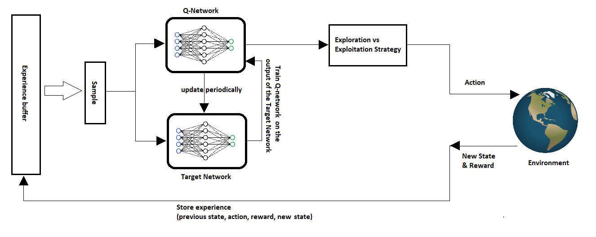
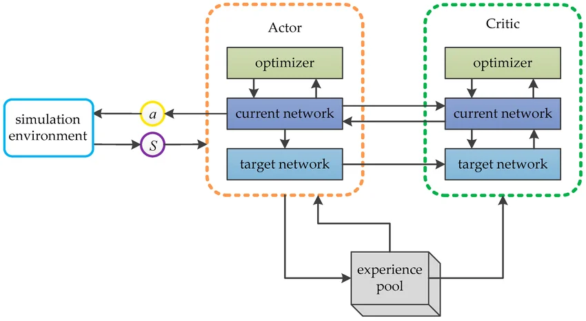
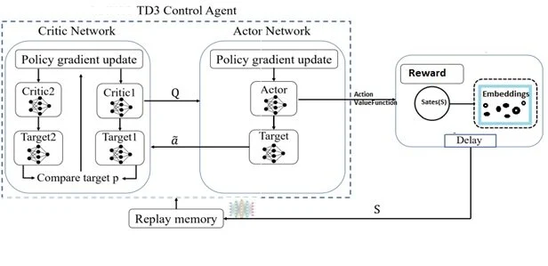

  

# Technical Report: Advanced Off-Policy Methods in Deep Reinforcement Learning
**Author:** Eduardo Martín Postigo
**Subject:** Comparative Analysis of DQN, TD3, and SAC

## 1. Introduction
Modern Deep Reinforcement Learning (DRL) has evolved from simple tabular methods to complex architectures capable of handling high-dimensional state spaces and continuous action domains. This report examines the transition from value-based discrete methods to state-of-the-art actor-critic stochastic frameworks, focusing on the mechanical improvements that provide stability and efficiency.

---
## 2. Core Definitions
To classify any Reinforcement Learning algorithm, we evaluate it across these four fundamental dimensions.

### A. Action Spaces 
* **Discrete:** The agent chooses from a finite, fixed set of actions.
    * *LaTeX:* $a \in \{0, 1, ..., n-1\}$.
    * *Analogy:* Using a D-pad or a keyboard (binary choices).
* **Continuous:** The agent outputs real-valued vectors, allowing for infinite precision within bounds.
    * *LaTeX:* $a \in \mathbb{R}^d$ typically within $[-1, 1]$.
    * *Analogy:* Using a steering wheel or a throttle pedal (gradient choices).

### B. Policy Types (The Decision Logic)
* **Deterministic:** Maps a state directly to a single, specific action.
    * *Formula:* $a = \mu(s)$.
    * *Behavior:* Exploitative and precise; requires external noise (like Gaussian) to explore.
* **Stochastic:** Maps a state to a probability distribution (usually a Gaussian mean $\mu$ and variance $\sigma$).
    * *Formula:* $a \sim \pi(a|s)$.
    * *Behavior:* Naturally exploratory; better for complex environments and handling uncertainty.

### C. Paradigms (The Data Efficiency)
* **On-Policy:** The agent learns only from data collected by its *current* version. Data is discarded after the update.
    * *Example:* **PPO**.
    * *Trait:* Stable but "expensive" (requires constant new environment interactions).
* **Off-Policy:** The agent learns from a **Replay Buffer** containing experiences from past versions of itself.
    * *Example:* **DQN, SAC, TD3**.
    * *Trait:* Highly sample-efficient; reuses data many times to squeeze out more learning.

### D. Architectures (The Brain Structure)
* **Value-Based:** Focuses exclusively on estimating the "quality" ($Q$) of every possible action. The policy is implicitly to "pick the highest $Q$."
    * *Constraint:* Hard to use in continuous spaces because you cannot calculate $\max$ over infinite values.
    * *Example:* **DQN**.
* **Actor-Critic:** Splits the model into two specialized networks.
    * **The Actor:** Learns *how* to behave (the policy).
    * **The Critic:** Learns to estimate the value of the Actor's actions.
    * *Example:* **DDPG, TD3, SAC, PPO**.
---
## 2. Comparative Methodology Overview
Once these few aspects are clarified, we can better understand the differences between each approach.

|  | **DQN** | **DDPG** | **TD3** | **SAC** | **PPO** |
| :--- | :--- | :--- | :--- | :--- | :--- |
| **Paradigm** | Off-Policy | Off-Policy | Off-Policy | Off-Policy | On-Policy |
| **Action Space** | Discrete | Continuous | Continuous | Continuous | Continuous |
| **Policy Type** | Deterministic | Deterministic | Deterministic | Stochastic | Stochastic |
| **Architecture** | Value-Based | Actor-Critic | Actor-Critic | Actor-Critic | Actor-Critic |
| **Exploration** | $\epsilon$-greedy | Added Noise | Added Noise | Max Entropy | Probability Dist. |
| **Stability** | Medium | Low | High | Very High | High |
| **Sample Efficiency**| High | High | High | Very High | Low |

---
## 3. DQN: Deep Q-Networks (The Value-Based Foundation)

DQN represents the first major successful integration of Deep Learning with Reinforcement Learning. It was the breakthrough that allowed agents to move beyond simple grids and solve tasks with high-dimensional sensory inputs, such as raw pixels, by approximating the optimal action-value function $Q^*(s, a)$ using a neural network.

### 3.1 Evolution: From Q-Table to Neural Network
The core shift in DQN is the **representation of knowledge**.

* **Q-Learning (The Table):** Traditional RL uses a literal matrix (Q-Table). 
* **DQN (The Approximator):** Uses a **Convolutional Neural Network (CNN)** as a function approximator. The network takes the pixel stack as input and predicts the Q-values for all available actions simultaneously. This allows the agent to **generalize**—it learns that a "red curb" means a turn, even if it has never seen that exact pixel arrangement before.

*Figure 1: Structural comparison between traditional Tabular Q-Learning and Deep Q-Networks (DQN). Traditional Q-Learning relies on an exhaustive lookup table, which becomes computationally infeasible for high-dimensional sensory inputs. In contrast, DQN utilizes a neural network (CNN) to approximate Q-values, enabling the agent to generalize patterns and features from raw pixel observations.*
**Source:** [Marta Comes Hernandez (Medium)](https://medium.com/@mcomeshernandez/reinforcement-learning-diving-into-deep-q-networks-dqn-92f237f448ec)

### 3.2 Theoretical Framework
DQN is fundamentally a **Value-Based** method. It does not learn a policy directly; instead, it learns to estimate the "quality" of taking a specific action in a specific state.

#### The Bellman Equation
The agent improves its estimation by iteratively solving the Bellman Equation. The goal is to minimize the difference between the current Q-prediction and the "Target" (the immediate reward plus the discounted value of the next best state):

$$Q(s, a) \leftarrow Q(s, a) + \alpha [r + \gamma \max_{a'} Q(s', a') - Q(s, a)]$$

#### The Loss Function
To train the neural network (CNN), we minimize the **Mean Squared Error (MSE)** between our current prediction and the stable target:

$$L(\theta) = \mathbb{E} \left[ ( {r + \gamma \max_{a'} Q(s', a'; \theta^{-})} - {Q(s, a; \theta)} )^2 \right]$$

* **$\gamma$ (Gamma):** The discount factor (usually 0.99).
* **$\theta$:** Weights of the Policy Network.
* **$\theta^{-}$:** Weights of the Target Network.

### 3.3 Stability
Standard neural networks are notoriously unstable when used for RL because the data is non-stationary (the agent's behavior changes as it learns). DQN solves this with three key mechanisms:

#### A. Epsilon-Greedy Strategy (Exploration vs. Exploitation)
Since DQN is a deterministic value-based method, the agent would always take the same "greedy" action if not forced to explore.
* **Mechanism:** With probability $\epsilon$, the agent chooses a random action (discovery); with probability $1-\epsilon$, it chooses the action with the highest predicted Q-value (mastery).
* **Decay:** We start with $\epsilon = 1.0$ and slowly decrease it as the agent becomes more proficient.

#### B. Experience Replay (The Replay Buffer)
In a driving simulation, consecutive frames are nearly identical. If the network learns from these frames in order, it suffers from "catastrophic forgetting" and high data correlation.
* **Mechanism:** The agent stores its experiences $(s, a, r, s')$ in a large memory buffer. 
* **Random Sampling:** During training, we pull a random "mini-batch" of memories. This breaks the temporal link between frames and ensures the gradient updates are stable and diverse.

#### C. Target Networks (The Anchor)
If we use the same network to calculate the prediction and the target, the target moves every time we update the weights. This creates a feedback loop that often leads to divergence.
* **Mechanism:** DQN uses two networks:
    1.  **Policy Network ($\theta$):** Updated every step; used to select actions.
    2.  **Target Network ($\theta^{-}$):** A frozen copy used to calculate the stable target. It is synchronized with the Policy Network only every $N$ steps.

### 3.4 Step-by-Step Training Loop

1. **Create Q-Network and Target-Network**
2. **Fill the Experience Buffer with data using the Q-Network**
3. **Repeat the following steps a sufficient number of times**
4. **Get a random sample from the Experience Buffer**
5. **Feed the sample as input to the Q-Network and Target Network**
6. **Use the output of the Target Network to train the Q-Network** (i.e. the output of the Target Network will play the role of the labels for the Q-Network in a standard supervised learning scenario)
7. **Apply Exploration / Exploitation strategy** (ex: Epsilon Greedy)
8. **If Exploration is selected then generate a random action, else If Exploitation is selected then feed the current state to the Q-Network and deduce action from the output.**
9. **Apply action to the environment, get the reward, and the new state**
10. **Store the old state, action, reward, and new state in the Experience buffer** (also called Replay Memory)
11. **Every few episodes, copy the weights from Q-Network to the Target-Network**

*Figure 1: Procedural architecture and data flow of a Deep Q-Network (DQN) training cycle.*

---

## 4. DDPG & TD3
### 4.1 DDPG:

DDPG was developed as a solution to the limitations of Deep Q-Networks (DQN) in continuous action spaces. While DQN relies on a discrete set of actions to calculate a maximum $Q$-value, DDPG utilizes an **Actor-Critic** architecture to output exact, continuous values.

#### Architecture and Components
*   **The Critic ($Q_{\theta}(s, a)$):** Learns to approximate the state-action value function. It evaluates how "good" a specific action $a$ is in state $s$.
*   **The Actor ($\mu_{\phi}(s)$):** Learns a deterministic policy that maps states directly to a specific action vector (Steering, Gas, Brake).

#### The Learning Mechanism
DDPG updates the Actor by moving it in the direction of the gradient provided by the Critic. This is known as the **Deterministic Policy Gradient**:

$$\nabla_{\phi} J \approx \nabla_a Q_{\theta}(s, a) \nabla_{\phi} \mu_{\phi}(s)$$

The Critic is updated by minimizing the Mean Squared Error (MSE) against a target $y$:

$$L = \mathbb{E} [(y - Q_{\theta}(s, a))^2]$$

where the target is computed using target networks ($\theta', \phi'$) to maintain stability:

$$y = r + \gamma Q_{\theta'}(s', \mu_{\phi'}(s'))$$

#### The Problem: Overestimation Bias

A fundamental flaw in DDPG is **Overestimation Bias**. Because the algorithm consistently uses the maximum estimated value (or the action that the Actor believes yields the maximum value) to calculate targets, noise in the $Q$-function leads to a positive bias. 

Over time, these errors accumulate, causing the agent to develop "delusions" about the value of certain states. In the context of car racing, this often manifests as the agent getting stuck in local optima or failing to recover from high-speed turns due to inaccurate value estimations.

#### Training loop

##### 1. Initialization
1. **Current Networks**: Initialize the **Actor** $\mu(s|\theta^\mu)$ and the **Critic** $Q(s, a|\theta^Q)$ with random weights.
2. **Target Networks**: Initialize target networks $\mu'$ and $Q'$ by copying the weights: $\theta^{\mu'} \leftarrow \theta^\mu$ and $\theta^{Q'} \leftarrow \theta^Q$.
3. **Memory**: Initialize the **Replay Buffer** $R$ to store experience tuples.

##### 2. Interaction Phase (Acting)
For each time step in the environment:
1. **Select Action**: Pass the current state $s$ through the **Current Actor**: $a = \mu(s|\theta^\mu)$.
2. **Exploration**: Add noise $\mathcal{N}$ (e.g., Ornstein-Uhlenbeck or Gaussian) to the action: $a_t = a + \mathcal{N}$.
3. **Execute**: Perform action $a_t$, observe reward $r$, and transition to the next state $s'$.
4. **Store**: Save the transition $(s, a, r, s')$ into the **Replay Buffer** $R$.

##### 3. Learning Phase (Training)
Sample a random minibatch of $N$ transitions from $R$ and perform the following updates:

+ A. Compute Target Value (The "Oracle")
Use the **Target Networks** to estimate the future value without the instability of immediate weight changes:
1. Get the next action: $a' = \mu'(s'|\theta^{\mu'})$.
2. Calculate the target $Q$-value: 
   $$y = r + \gamma Q'(s', a'|\theta^{Q'})$$

 + B. Update Current Critic
The Critic learns to minimize the Mean Squared Error (MSE) between its current prediction and the target value $y$:
$$L = \frac{1}{N} \sum (y - Q(s, a|\theta^Q))^2$$
*Update $\theta^Q$ via gradient descent.*

 + C. Update Current Actor
The Actor is updated using the **Deterministic Policy Gradient**. It adjusts its weights to maximize the $Q$-value provided by the (now updated) Current Critic:
$$\nabla_{\theta^\mu} J \approx \frac{1}{N} \sum \nabla_a Q(s, a|\theta^Q) \big|_{a=\mu(s)} \nabla_{\theta^\mu} \mu(s|\theta^\mu)$$
*Update $\theta^\mu$ via gradient ascent.*

##### 4. Synchronization (Soft Update)
Instead of a "hard" copy, the Target Networks are updated incrementally to track the Current Networks slowly:
* **Target Critic**: 
  $\theta^{Q'} \leftarrow \tau \theta^Q + (1 - \tau) \theta^{Q'}$
* **Target Actor**: 
  $\theta^{\mu'} \leftarrow \tau \theta^\mu + (1 - \tau) \theta^{\mu'}$

*Figure 3. Block diagram of an Actor-Critic Reinforcement Learning architecture featuring Experience Replay and Target Networks. The schema illustrates the interaction loop where the **Actor** selects actions, transitions are stored in memory, and the **Critic** provides action gradients to update the Actor based on sampled experience and target value calculations.*

### 4.2 TD3: Improvements

TD3 (Twin Delayed DDPG) introduces three specific mechanisms to address the instabilities of DDPG.

####  1: Clipped Double Q-Learning
To combat overestimation, TD3 employs **two independent Critic networks** ($Q_{\theta_1}, Q_{\theta_2}$). When calculating the target value, it takes the **minimum** of the two estimates. This conservative approach prevents the agent from over-exploiting noisy $Q$-value peaks.

**TD3 Target Definition:**
$$y = r + \gamma \min_{i=1,2} Q_{\theta'_i}(s', a')$$

#### 2: Delayed Policy Updates
DDPG updates the Actor and Critic simultaneously at every step. However, if the Critic is still inaccurate, the Actor's update will be based on "false" information. TD3 addresses this by:
1. Updating the **Critics** at every step.
2. Updating the **Actor** and all **Target Networks** only every $d$ steps (typically $d=2$).

This allows the value function to stabilize before the policy is allowed to change.

#### 3: Target Policy Smoothing
Deterministic policies are prone to overfitting to narrow "spikes" in the $Q$-function. TD3 adds clipped random noise to the action used for the target calculation. This serves as a regularizer, forcing the Critic to learn that similar actions should yield similar rewards.

**Smoothed Target Action:**
$$a' = \text{clip}(\mu_{\phi'}(s') + \epsilon, a_{low}, a_{high})$$
$$\epsilon \sim \text{clip}(\mathcal{N}(0, \sigma), -c, c)$$

#### Training Loop

##### 1. Initialization
1. **Current Networks**: Initialize one **Actor** $\mu(s|\theta^\mu)$ and **two Critics** $Q_1(s, a|\theta^{Q_1})$, $Q_2(s, a|\theta^{Q_2})$ with random weights.
2. **Target Networks**: Initialize target networks for all three: $\theta^{\mu'} \leftarrow \theta^\mu$, $\theta^{Q_1'} \leftarrow \theta^{Q_1}$, and $\theta^{Q_2'} \leftarrow \theta^{Q_2}$.
3. **Memory**: Initialize the **Replay Buffer** $R$.

##### 2. Interaction Phase (Acting)
Identical to DDPG:
1. Select action $a = \mu(s|\theta^\mu) + \epsilon$, where $\epsilon$ is exploration noise.
2. Execute action, observe reward $r$ and next state $s'$.
3. Store transition $(s, a, r, s')$ in $R$.

##### 3. Learning Phase (The "Twin" and "Delayed" Logic)
Sample a minibatch of $N$ transitions. TD3 performs a specific sequence:

+ A. Target Policy Smoothing
When calculating the target value, TD3 adds a small amount of clipped noise to the target action to prevent the policy from exploiting inaccuracies in the Q-function:
$$\tilde{a} = \mu'(s'|\theta^{\mu'}) + \text{clip}(\epsilon, -c, c)$$

+ B. Clipped Double Q-Learning (The "Twin" Critics)
To combat overestimation, TD3 uses the **minimum** value between the two target critics:
$$y = r + \gamma \min_{i=1,2} Q_i'(s', \tilde{a}|\theta^{Q_i'})$$

+ C. Update Current Critics
Both current critics are updated by minimizing the MSE loss against the same target $y$:
$$L_i = \frac{1}{N} \sum (y - Q_i(s, a|\theta^{Q_i}))^2 \quad \text{for } i \in \{1, 2\}$$

+  D. Delayed Policy & Target Updates
This is the "Delayed" part. The Actor and all Target networks are updated **less frequently** (every $d$ steps, usually $d=2$) than the Critics:
1. **Update Current Actor**: Using the gradient from $Q_1$ (only one critic is used for the actor gradient).
2. **Soft Update Targets**: Slowly update all three target networks: 
    * **Target Critic**: 
  $\theta^{Q'} \leftarrow \tau \theta^Q + (1 - \tau) \theta^{Q'}$
   * **Target Actor**: 
  $\theta^{\mu'} \leftarrow \tau \theta^\mu + (1 - \tau) \theta^{\mu'}$

 *Figure 4. Block diagram of the specialized Twin Delayed DDPG (TD3) control agent architecture. The schematic prominently features the dual-critic structure (Twin Critics, labeled Critic1 and Critic2) designed to address value overestimation. It shows separate Target Critic networks and a Target Actor network. Key elements include the target value comparison ("Compare target Q"), policy gradient update pathways, an experience replay memory, and a delayed state feedback loop from the environment, all contributing to more stable and efficient reinforcement learning.*

---

### 4.3 Summary Comparison

| Feature | DDPG | TD3 |
| :--- | :--- | :--- |
| **Critics** | One Network | Two (Twin) Networks |
| **Target Logic** | $Q(s', \mu(s'))$ | $\min(Q_1, Q_2)(s', a')$ |
| **Update Cadence** | Simultaneous | Delayed Policy Updates |
| **Policy Robustness** | Susceptible to $Q$-spikes | Target Policy Smoothing |
| **Performance** | High variance | Stable & Robust |

---

## 4. Soft Actor-Critic (SAC): Maximum Entropy Framework
SAC is an off-policy actor-critic algorithm that utilizes a stochastic policy. It is distinguished by its focus on **Maximum Entropy Reinforcement Learning**.

### 4.1 Entropy Regularization
Instead of just maximizing the expected reward, SAC aims to maximize the reward plus the entropy ($\mathcal{H}$) of the policy. Entropy represents the "randomness" or "uncertainty" of the agent's choices.
$$J(\pi) = \sum_{t=0}^{T} \mathbb{E}_{(s_t, a_t) \sim \rho_\pi} [r(s_t, a_t) + \alpha \mathcal{H}(\pi(\cdot|s_t))]$$

### 4.2 Key Advantages
* **Automatic Exploration:** The agent is incentivized to explore all possible actions that lead to high rewards, preventing premature convergence to local optima.
* **Robustness:** Because the policy is stochastic, it is naturally more robust to noise and changes in environment dynamics compared to deterministic methods like TD3.
* **Reparameterization Trick:** To allow backpropagation through stochastic sampling, SAC expresses the action as a deterministic function of the state and independent noise: $a = f_{\theta}(\epsilon, s)$.

---

## 5. Comparative Analysis

| Feature | DQN | TD3 | SAC |
| :--- | :--- | :--- | :--- |
| **Action Space** | Discrete | Continuous | Continuous |
| **Policy Nature** | Deterministic | Deterministic | Stochastic |
| **Stability Strategy** | Target Network | Clipped Double-Q | Entropy Regularization |
| **Exploration** | $\epsilon$-greedy | Additive Noise | Entropy Maximization |

---

## 6. Conclusion
The progression from DQN to SAC shows a shift from stabilizing value targets toward stabilizing the exploration process itself. DQN introduced the necessary infrastructure (Buffers and Targets), TD3 refined the value estimation through pessimism (Clipped Q), and SAC integrated exploration directly into the mathematical objective through Entropy. Understanding these differences allows researchers to select the most appropriate tool based on the complexity and continuity of the task at hand.

## 4. The Evolutionary Journey: Why we moved forward

### 1. DQN to DDPG: Crossing the Continuous Gap
DQN was limited to buttons. **DDPG** introduced the Actor-Critic framework to off-policy learning, allowing for "pedal" control. However, DDPG was prone to "divergence"—it would often learn a bad policy and never recover because its Critic was too optimistic.

### 2. DDPG to TD3: Implementing "Pessimism"
**TD3** fixed DDPG by adding three stability mechanisms:
* **Clipped Double-Q:** Using two critics and taking the minimum prevents the agent from overestimating how good a state is.
* **Target Policy Smoothing:** Adding noise to targets prevents the actor from exploiting sharp "peaks" in the value function.
* **Update Rule:** $$y = r + \gamma \min_{i=1,2} Q_{\theta_{target, i}}(s', \mu_{\phi_{target}}(s') + \epsilon)$$

### 3. TD3 to SAC: Embracing Randomness (Entropy)
While TD3 is precise, it can be rigid. **SAC** introduced **Entropy Regularization**. Instead of just trying to get a high score, SAC tries to get a high score while being as "random" as possible.
* **Entropy ($\mathcal{H}$):** This ensures the agent never stops exploring until it is absolutely certain of the optimal path.
* **Objective:** $$J(\pi) = \sum_{t=0}^{T} \mathbb{E} [r(s_t, a_t) + \alpha \mathcal{H}(\pi(\cdot|s_t))]$$

---

## 5. Summary for Students
* If your task is **discrete** (like Chess): Use **DQN**.
* If you need **simple, reliable** continuous control and have time to train: Use **PPO**.
* If you need **maximum efficiency** and robust exploration in continuous space: Use **SAC**.
* If you need **deterministic precision** (robotics): Use **TD3**.